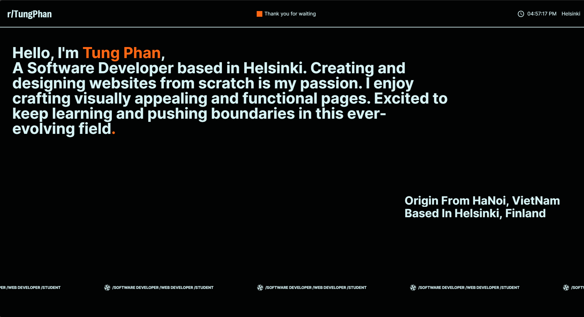

<<<<<<< HEAD
<div align="center">
=======


>>>>>>> 1e0e3609d9d2ba0000835d762e7890e4decf38e0

<a target="_blank" href="https://tungphan.id.vn/" className="rounded-3xl shadow-xl">
    
</a>

[](https://tungphan.id.vn/)

[](https://vercel.com/tung-phans-projects/portfolio-2-pihb)

[](https://vercel.com/home?utm_source=nuro&utm_campaign=oss)

</div>


## 🛠 Development

Clone the repository

```zsh
git clone https://github.com/tungphan2823/portfolio_2
```

Install dependencies

```zsh
npm install

# Or using Yarn

yarn
```

Start the development server

```zsh
npm run dev

# Or using Yarn

<<<<<<< HEAD
yarn dev
```

Build for production

```zsh
npm run build

# Or using Yarn

yarn build
```
=======

>>>>>>> 1e0e3609d9d2ba0000835d762e7890e4decf38e0
